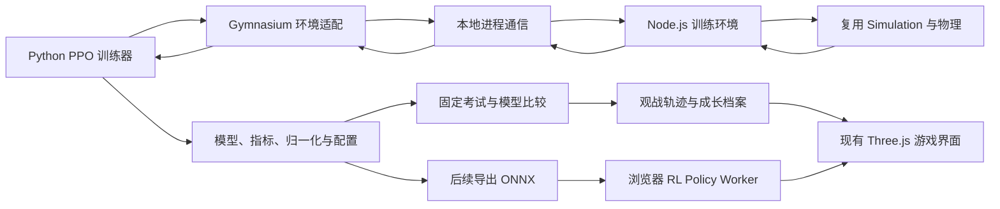

# JevPilot 强化学习训练与成长观战方案

> 方案日期：2026-09-28。本文描述整体目标，未标为已完成的目录、接口、面板和课程仍属于后续实施方案。2026-09-29 已实现并验证本机 CPU 最小直路训练，具体操作见 [本机训练说明](../training/README.md)，结果见 [首次实验记录](../training/RESULTS.md)。目标阈值和训练规模是实验起点，不是效果或耗时承诺。

> 2026-09-29 运行方式确认：首版在用户本机 Windows 上使用 CPU 训练，暂不考虑服务器或 Jupyter Notebook。先完成训练内核和 Python 封装，短训练确认有效后，再安排夜间长时间运行。

### 首版本机运行约定

- **实施前环境检查**：Node.js 22.20.0、base Python 3.12.7（Anaconda），系统报告 20 个逻辑处理器。现已另建 Python 3.11 的 `jevpilot-rl` 环境并安装训练依赖，base 保持不变。逻辑处理器数量不代表进程实际可持续占用的算力。
- **安装方式**：实施时创建项目专用 Python 环境，使用经过验证并锁定版本的依赖；首版显式设置 `device="cpu"`。
- **验证顺序**：先验证单环境的重置、物理、奖励和结束事件，再运行短 PPO 实验。比较随机初始化与训练后模型在固定验证集上的成功率、离路率和进度；确认学习信号后再延长训练。
- **并行方式**：从 1 个环境开始，实测后比较 4/8 个环境。限制 PyTorch/BLAS 线程数，避免环境进程和计算线程争抢 CPU；Windows 多进程从带主入口保护的脚本启动。
- **夜间训练**：训练入口应支持时长预算及步数上限，在完整 PPO 更新边界检查停止条件，因此实际结束时间可能略晚于预算。定期保存完整检查点、固定评估结果和日志，并在正常结束时保存最后一个版本。长跑前检查剩余磁盘空间、接通电源，并由用户确认系统不会因睡眠而暂停任务。
- **恢复方式**：从已完成的检查点恢复模型、优化器、累计步数和课程状态，从新回合继续；不承诺重现中断瞬间的环境与未完成采样。
- **验收边界**：一晚是可用的时间预算，不代表一定学会驾驶。先测有效策略步吞吐，再估算一晚能完成的规模；若短训练没有改善，先诊断环境和奖励，不直接增加时长。

实施进展（2026-09-29）：已创建 `jevpilot-rl` Conda 环境并安装 CPU 依赖，完成独立直路课程 `straight-pass-v1`、Node 通信、Gymnasium 封装、PPO 训练、固定验证、检查点与新回合恢复。单环境 102400 步实验已完成；未启动整晚训练。该课程仅考察通过终点，不考察停车，不能等同于下文完整训练及观战方案已实现。

## 1. 我们要做成什么

目标是培养一个能在 JevPilot 中持续进步的驾驶模型，并让整个成长过程可观察、可比较、可回看。

理想体验是：第一次启动时，它可能转向过度、不会刹车、在路口犹豫；训练一段时间后，它开始沿路前进；再经过课程训练，它能完成转弯、停车、跟车和避让；最终能够应对未见过的地图以及用户亲手设计的挑战。

这个目标包含两个同等重要的部分：

1. **训练系统**：提供可高速运行、结果可核对的环境，训练出有泛化能力的策略。
2. **成长观战系统**：保存从随机初始化到后期的模型，让用户看到能力变化，而不只看到一条奖励曲线。

建议第一版的完整闭环为：

```text
随机策略 → 简单道路训练 → 定期保存模型 → 固定考试 → 浏览器观看历史模型
                 ↑                                  ↓
                 └──────── 发现短板并增加课程 ────────┘
```

先实现一个范围小但可以真正“养起来”的驾驶员，再逐步覆盖现有复杂城市。

## 2. 推荐路线与边界

### 2.1 主线：训练独立驾驶策略网络

推荐使用 **Python + PyTorch + Stable-Baselines3 PPO**，训练一个接收结构化道路与交通信息、输出转向和纵向控制的小型神经网络。

仿真继续使用项目现有 JavaScript 代码；Python 负责训练；浏览器负责展示和后续本地推理。这样可以复用已有世界、运动、碰撞、交通和挑战系统。

训练主线从随机初始化开始，不默认使用专家预训练，以保留完整的新手成长过程。训练得到的是项目自己的驾驶策略模型，**不是对远端 Jev API 背后的模型进行参数更新**。当前仓库没有 Jev 权重、优化器或供应商训练接口，不能仅靠反复调用 `/api/decide` 完成对 Jev 的强化学习微调。

PPO 在所选实现中支持连续动作和并行采样，适合作为首个易调试的基线；本文的参数与课程是针对本项目提出的设计。实现时应锁定一组兼容的正式发布依赖，不直接追随文档 `master` 所显示的开发版本。[PPO 官方文档](https://stable-baselines3.readthedocs.io/en/master/modules/ppo.html)

### 2.2 保留两条研究分支

| 路线 | 模型负责什么 | 优点 | 局限 | 建议 |
| --- | --- | --- | --- | --- |
| 连续控制 PPO | 转向、加速和制动 | 成长明显，能学习驾驶细节 | 初期失败多，奖励设计较难 | 第一主线 |
| 候选选择 MaskablePPO | 从现有规划器候选中选择 | 复用规划，较快获得可用驾驶 | 能力上限受候选覆盖和规则限制 | 后续对照实验 |
| 图像输入策略 | 从相机图像学习控制 | 更接近视觉驾驶研究 | 训练成本和感知难度大 | 暂缓 |
| Jev 示范后再强化学习 | 从专家行为热启动 | 缩短冷启动 | 示范有成本，也可能继承缺陷 | 主线稳定后可选 |

候选选择路线可以更快呈现“会开”，但新模型可能主要是在复用已有路线跟随与安全能力。连续控制更符合“从蹩脚到熟练”的体验，因此作为默认方案。

### 2.3 第一版明确不做的范围

第一版聚焦单个玩家驾驶策略，保留已有 NPC 交通规则；不同时训练所有车辆，不加入多人对抗，不把训练搬到 Cloudflare，也不把截图和浏览器点击作为训练环境接口。

先使用结构化观测，并明确标识其来源。观察交通对象坐标不代表模型掌握了视觉识别能力。

## 3. 现有项目能复用什么

| 当前模块 | 可复用能力 | 需要新增或审计的部分 |
| --- | --- | --- |
| `src/simulation.js` | 世界状态、步进、交通、碰撞、到达和违规 | 独立控制入口、固定时间步、训练结束事件 |
| `src/planning.js` | `pedalPhysics()`、`physics()` 和控制计算 | 明确 RL 采用哪套动作语义 |
| `src/world.js`、`src/highway.js` | 地图种子、道路与路线 | 简单课程地图、可配置交通密度 |
| `src/road-geometry.js` | 轮廓、边界、路面占用 | 固定长度的道路观测编码 |
| `src/traffic-safety.js`、`src/collisions.js` | 交通关系与碰撞 | 训练指标和安全干预来源记录 |
| `src/challenge-model.js` | 编排对象、草稿校验和挑战结果 | 训练场景加载及独立评分适配 |
| `src/challenge-traffic.js` | 挑战车辆继续行驶 | 课程交通与背景交通配置 |
| `src/scene.js` | 原有三维画面 | 观战、历史模型切换、回放数据驱动 |
| `src/decision-trace.js` | 部分决策和执行记录 | 完整轨迹格式、流式存储 |
| `tests/` | 已有运动与交通回归测试 | 环境契约、奖励、确定性和策略部署验证 |

现有 `Simulation` 已经能被 Node.js 测试直接导入，这是无渲染训练的重要基础。不过，“可以导入”不等于训练适配已经完成：仍需审计所有依赖、随机源、状态重置和规则副作用。

尤其注意当前执行分支：

- `autopilot = true` 时，会使用机动参数、目标速度以及自动驾驶安全速度限制。
- `autopilot = false` 时，使用 `steeringInput`、`pedals.throttle`、`pedals.brake` 驱动 `pedalPhysics()`。
- `Simulation.step(dt)` 内部把 `dt` 限制到不超过 0.05 秒。
- `decision-trace.js` 当前仅在自动驾驶条件下记录部分执行信息，不能直接作为人工语义 RL 的完整采样记录。

因此不能简单把 PPO 输出写到 `player.target`，也不能用一次 `step(1)` 当作推进一秒。

## 4. 整体架构



训练和显示分开运行：训练环境尽量快地推进模拟时间，不加载 Three.js、不启动浏览器、不等待真实时间；观战端按正常速度或用户指定倍速展示某一模型的表现。

训练主进程持续更新的权重不能被观战端边写边读。观战使用已完成、原子发布的 checkpoint；刷新模型以完整版本为单位，不能在一局中无提示切换参数。

### 4.1 建议新增目录

```text
src/rl/
  environment.js          Node/浏览器共享的训练环境内核
  observation.js          观测编码、裁剪、有效位和版本
  action.js               动作映射与控制适配
  reward.js               奖励分解
  termination.js          结束与截断规则
  scenarios.js            课程场景生成
  metrics.js              事件与评估指标
  policy-controller.js    RL 驾驶控制器
  policy.worker.js        后续浏览器推理线程
  replay.js               观战轨迹格式和读取

scripts/rl/
  env-server.mjs          无渲染仿真子进程入口
  benchmark.mjs           环境吞吐与确定性检查
  record-evaluation.mjs   考试轨迹导出

training/
  pyproject.toml          Python 依赖定义
  jevpilot_env.py         Gymnasium 封装
  train.py               PPO 训练入口
  evaluate.py            独立评估
  export_policy.py       后续模型导出
  configs/               奖励、课程、算法与实验配置
  manifests/             固定评估集和场景版本

tests/rl/                JS 环境及奖励测试
training/tests/          Python 契约与模型接口测试
artifacts/rl/            本地大体积产物，默认不进入普通 Git
```

建议把 `artifacts/rl/` 的日志、大模型和轨迹加入忽略规则。Git 保存代码、配置、评估集清单和小型汇总；浏览器发布模型单独挑选、压缩并记录来源，不提交每个训练快照。

当前 `npm test` 只匹配 `tests/*.test.js`，新增 `tests/rl/` 后需增加专项命令或调整匹配范围，避免测试文件存在却没有被执行。

## 5. 环境接口：让游戏成为可训练任务

### 5.1 核心接口

设计以下共享环境契约：

```javascript
// 设计示意，当前仓库尚不存在此接口。
const env = new DrivingEnv(config);
const initial = env.reset({ seed: 42, scenario: "straight-v1" });
// initial: { observation, info }

const result = env.step([steering, longitudinal]);
// result: { observation, reward, terminated, truncated, info }
```

`info` 至少包含：场景 ID、种子、回合 ID、模拟时间、奖励各分量、进度、碰撞对象类型、违规事件、安全接管量、结束原因，以及策略请求动作和真正执行动作。

Gymnasium 的 `reset()` 与 `step()` 应遵守其正式契约；Python 适配器负责调用 `super().reset(seed=seed)` 并将确定的种子传给 JavaScript，不能只初始化 Python 随机数而漏掉仿真随机源。[Gymnasium 环境 API](https://gymnasium.farama.org/api/env/)

### 5.2 时间粒度

建议固定：

- 物理步长：`0.025 s`，即 40 Hz。
- 策略决策间隔：`0.1 s`，即 10 Hz。
- 每个 RL step 保持同一个动作，内部推进 4 个物理子步。
- 任一子步发生终止事件时立即停止后续子步，并返回最后有效观测。
- 奖励中的时长项使用实际推进的时间，不假定所有 step 都完整运行 0.1 秒。

固定步长让训练、考试和浏览器执行有一致的控制语义。不能把现有 Jev 的 250/650 毫秒自适应请求间隔直接混入主线 PPO 环境，否则同一个动作步对应的时间和折扣含义会变化。

浏览器部署时增加固定步长累积器，显示仍可按帧率插值。推理迟到时采用明确的保持上次动作或制动策略，并单独统计；不能忽快忽慢地推进游戏时间。

### 5.3 结束与截断

| 条件 | 建议返回 | 原因 |
| --- | --- | --- |
| 到达并满足终点停车要求 | `terminated = true` | 任务完成 |
| 碰撞 | `terminated = true` | 当前课程的失败状态 |
| 持续离开道路并满足失败阈值 | `terminated = true` | 课程明确规定的失败 |
| 规定任务截止时间耗尽 | `terminated = true` | 若限时是任务本身，属于失败；观测必须含剩余时间 |
| 仅为控制采样长度设置的上限 | `truncated = true` | 环境并非自然结束，需要正确处理价值 bootstrap |
| 用户停止训练、进程崩溃、非法数值 | 不伪造普通终止样本 | 保存状态、报错或丢弃损坏采样 |

“卡住”应先定义为任务失败还是采样保护。固定课程中可把无正当等待原因的长时间无进展设为任务失败；红灯、行人和合法排队等待不得直接算卡死。

限时任务与外部时间截断的价值处理不同，需要分别实现。[Gymnasium 时间限制说明](https://gymnasium.farama.org/tutorials/gymnasium_basics/handling_time_limits/)

## 6. 动作空间：让模型真正学开车

### 6.1 主线动作定义

采用二维连续动作 `Box(-1, 1, shape=(2,))`：

```text
a[0] = 转向输入，-1 左，+1 右
a[1] = 纵向输入，正值加速，负值刹车

steeringInput   = clip(a[0], -1, 1)
pedals.throttle = max(0, clip(a[1], -1, 1))
pedals.brake    = max(0, -clip(a[1], -1, 1))
```

第一阶段不提供倒车，先学正向行驶与停车。这里的“转向”是现有 `pedalPhysics()` 的虚拟操纵杆输入，不是直接设置前轮角度；现有转向积累、回正和高速转向限制会继续生效。

为避免控制器互相覆盖，新增明确的 `controlMode: human | jev | rl` 或等价控制适配层。RL 仍调用人工踏板物理，但 `main.js` 的键盘更新不能每帧覆盖 RL 踏板，也不能触发 Jev 网络请求。更改控制入口后要对原有人工与 Jev 模式做回归验证。

倒车与脱困安排到独立后续课程。若新增档位或第三个动作通道，必须升级 `action_schema_version`，不能用旧模型猜测新动作含义。

### 6.2 安全辅助的三种模式

| 模式 | 行为 | 使用场景 |
| --- | --- | --- |
| `raw` | 无额外自动避障与自动减速，保留物理限制及碰撞检测 | 主训练与裸策略考试 |
| `shielded` | 在动作执行前限制迫近风险，明确记录动作被修改 | 可选辅助训练、演示 |
| `jev-native` | 原有 Jev 规划与安全执行路径 | 系统基线 |

`sim.safety = false` 不能直接等同于完全移除所有规则干预。还需审计停车机动、车道跟随、边界夹紧、到达停车、重规划以及其他玩家状态修改。NPC 自身交通规则继续保留。

主线 RL 不安装 Jev 的 `maneuver`，并显式清除上一驾驶模式残留的目标与机动参数。游戏边界夹紧等无法立即移除的行为应标为环境规则，并以越界事件终止或扣分，避免模型学会“蹭边界”。

辅助模式和裸策略模式分开报告。若辅助器修改了动作，PPO 记录的是原始策略采样动作及其 log probability，环境反馈反映辅助后的转移；另外保存执行动作，不能用执行动作替换训练样本里的采样动作。否则会破坏策略更新的一致性。

## 7. 观测空间设计

### 7.1 先用固定长度结构化观测

首版不把完整 `decisionState()` JSON 原样传给网络，也不输入全地图、随机种子、全局对象 ID 或专家答案。观测使用车辆局部坐标，减少模型记住地图编号的机会。

建议内容如下；具体维度在实现观测清单时锁定。

| 观测组 | 建议字段 |
| --- | --- |
| 自车 | 有符号速度、前轮转角、转向积累状态、角速度、前一动作、加速度 |
| 路径误差 | 横向偏移、朝向误差的 sin/cos、道路内比例 |
| 前方路径 | 5/10/20/35/50 米处的局部路径点、曲率、左右路面余量与有效位 |
| 导航 | 前方转弯类型、转弯距离、当前限速、目的地剩余距离 |
| 交通控制 | 信号类型与状态、停车线距离、停车要求是否完成 |
| 邻近参与者 | 最多 12 个对象的类型、相对位置、相对速度、朝向、长宽和有效位 |
| 任务 | 课程允许能力、剩余时间比例；避免输入能直接标识具体考题的 ID |

12 个邻近对象只是起始容量。应按预计冲突或距离排序，并使用稳定的并列排序；记录“风险对象因容量限制被丢弃”的比例。槽位不足时扩大感知容量，不能把感知遗漏当成模型不会避让。

优先复用当前 `scanScene()` 的可见对象规则，避免训练端能看见墙后的全部交通，而浏览器部署端只能看到局部感知。道路导航可使用已有路线，这是本方案明确授予的导航信息。

### 7.2 归一化与缺失值

- 距离、速度等按明确尺度裁剪、归一化。
- 角度用 sin/cos 表示，避免跨越正负 π 的跳变。
- 不存在的对象使用零填充加有效位，不能把真实零速度误判为不存在。
- 禁止 NaN/Infinity 进入网络。
- 如使用运行均值/方差归一化，统计只从训练数据更新；验证、测试和浏览器使用冻结副本。
- 模型、观测顺序、归一化参数和物理版本必须作为同一制品发布。

首版建议固定尺度归一化，降低浏览器部署与训练不一致的概率；确有需要时再引入运行统计。

### 7.3 时间记忆

先堆叠最近 4 帧自车与交通观测，覆盖约 0.3 秒历史，再根据失败分析决定是否使用循环网络。重置后用首帧或带有效位的零帧填充，不能混入上一回合历史。

帧堆叠不保证整个问题完全满足马尔可夫性，但能帮助估计运动趋势。后续若增加 LSTM，必须正确重置回合隐藏状态，并处理训练与导出兼容性。

## 8. 奖励：鼓励有效驾驶，防止投机取巧

### 8.1 奖励必须拆开记录

建议把总奖励写成多个可检查分量：

```text
r = 路线进度奖励
  + 到达奖励
  - 碰撞惩罚
  - 离路惩罚
  - 违规惩罚
  - 无效等待惩罚
  - 操作抖动惩罚
  - 适度时间成本
```

不要只显示总分。训练中至少同时记录每个分量、成功率和事故率，以发现模型是不是通过奖励漏洞“变聪明”。

### 8.2 可用的第一组参数

下表仅用于开始调试，单位以 0.1 秒策略步和实际子步时长为基础；运行手工策略后再校准。

| 奖励项 | 初始建议 | 计算要求 |
| --- | --- | --- |
| 有效路线进度 | `+0.2 × delta_s` | `delta_s` 为米，带符号、限制不合理跳变，并要求处在路线允许走廊 |
| 成功到达 | `+100` | 仅一次，位置、朝向和速度条件满足 |
| 碰撞 | `-100` 并终止 | 分类型统计，首版保持简单 |
| 持续离路 | `-2 × offroad_fraction × dt` | 按实际时间累计，超阈值再终止 |
| 交通违规 | 每个独立事件 `-10` | 不能每个物理子步重复扣同一个事件 |
| 无正当原因停车 | 等待宽限后 `-0.2 × dt` | 区分红灯、行人和排队 |
| 时间成本 | `-0.05 × dt` | 小于必要等待的收益尺度，不压过安全 |
| 操作抖动 | `-0.02 × ||a_t-a_(t-1)||²` | 在策略步上计算，避免无限追求平滑 |

速度不直接越快越高分。到达条件应明确要求低于某一速度阈值，不能高速撞过终点线也算熟练驾驶。

`delta_s` 不能只取 `max(0, delta_s)`，否则前后移动可以反复刷正进度。路线投影应使用连续路段匹配，限制单步可能进度；改道时重新对齐基准，不为剩余距离的突然变化发奖励。

第一批课程锁定路线、不动态重规划，更容易验证进度奖励。后续可用带终止处理的势函数差分或沿合法路网的距离变化，但需要独立测试，不能只按直线距离奖励抄近路。

### 8.3 必测的奖励漏洞

| 投机行为 | 防范与检查 |
| --- | --- |
| 原地来回刷进度 | 往返动作脚本的净进度奖励不得为正 |
| 穿建筑或切弯走草地 | 路面约束、碰撞和合法路线走廊 |
| 永远停着避免事故 | 成功率与任务时限；有条件的等待成本 |
| 闯红灯节省时间 | 独立违规事件与安全优先评估 |
| 快到终点时反复进出 | 一次性终止奖励 |
| 主动撞车逃避长时间扣分 | 检查碰撞与持续失败的回报尺度，缩短无意义失败回合 |
| 依赖辅助器急刹 | 对比 raw/shielded，记录干预时长和动作差 |
| 蹭地图边界或瞬移 NPC | 越界标记、重生事件过滤、进度连续性检查 |

每次修改奖励后都生成新的 `reward_version`。不同奖励版本的总分不能直接连成一条曲线，业务指标可以放到共同考试集比较。

## 9. 课程学习：把“新手期”设计得有层次

### 9.1 课程表

| 阶段 | 训练场景 | 新能力 | 建议通过条件 |
| --- | --- | --- | --- |
| L0 起步 | 宽直路、无交通、短距离 | 加速、轻微纠偏 | 固定验证集成功率 ≥90% |
| L1 沿路 | 不同宽度、初始偏角、缓弯 | 稳定转向 | 成功率 ≥90%，离路时间显著下降 |
| L2 转弯停车 | 路口转向、终点停车 | 提前减速、转弯后回正 | 成功率 ≥85%，终点速度达标 |
| L3 路权 | 红绿灯、停车标志 | 合法等待、通过路口 | 成功率 ≥85%，违规率 ≤5% |
| L4 跟车 | 不同速度前车、停车再启动 | 保持间距、及时刹车 | 碰撞回合率 ≤5% |
| L5 动态避让 | 行人、横穿车、摩托车 | 风险预判 | 分场景分别达到安全门槛 |
| L6 城市导航 | 完整小镇/城市路线 | 连续驾驶、复杂交互 | 留出地图成功率 ≥80% |
| L7 高速 | 匝道、合流、较高速度 | 提前规划和稳定性 | 高速单独考试达标 |
| L8 综合挑战 | 用户编排与未见组合 | 鲁棒性、泛化 | 人工挑战集和最终测试集分别报告 |

这些门槛是建议的晋级条件，不承诺训练一定达到。每次晋级至少在连续两次固定验证中达标，并展示样本数；不能在很少回合偶然成功后自动升阶。

L0～L2 建议新建简单训练世界生成器，复用同一车辆与碰撞代码。初始路线应短，几秒到几十秒能得到清晰反馈。直接从当前完整繁忙城市开始，通常难以判断失败究竟来自方向控制、交通还是奖励。

### 9.2 防止学了新技能忘旧技能

每轮采样建议混合：60% 当前课程、30% 已掌握课程、10% 探索性难例。比例作为配置，按结果调整。

早期限制最高速度和交通密度属于课程条件，必须写入环境配置并在观测中体现可用速度限制。最终考试统一目标配置，不能以持续降低难度换取“变强”的图表。

### 9.3 场景随机化

分阶段随机化道路长度、弯道、车流密度、初始横向位置、前车速度、行人触发距离与信号相位。初期先改变少量因素，学会后再扩大范围。

晚期可加入轻微观测噪声、控制延迟和物理参数扰动，但必须保持物理可解释，并且训练、评估和发布配置清晰分离。首版不随机化所有因素。

用户设计的挑战可以加入训练池，也可以保留为盲测。一旦用于调奖励或训练，就必须从最终盲测池移走，避免把反复练习的题目当作泛化成绩。

## 10. Python 与 Node.js 如何通信

### 10.1 首版采用持久子进程

Python Gym 环境启动一个持久 Node.js 子进程，通过 stdin/stdout 的逐行 JSON 发送 `reset`、`step`、`close` 命令。只传紧凑数值数组和必要指标，不传模型资源或整个地图。

每个报文包含 `protocol_version`、`request_id`、`env_id` 和命令。stdout 只输出协议数据，调试日志走 stderr。设置请求超时、进程异常退出检测和显式关闭，避免僵尸进程。

Node 侧执行顺序为：接收动作 → 应用控制 → 推进固定子步 → 提取观测 → 计算奖励与结束条件 → 返回。所有操作不调用外部模型。

### 10.2 并行环境

先验证 1 个环境，再扩展 4/8 个环境。初版可让每个 Python 环境拥有一个 Node 进程；吞吐成为瓶颈后，再考虑一个 Node 进程管理多个环境并批量请求。

Windows 多进程入口使用 `if __name__ == "__main__":`，显式管理子进程生命周期，不假定 Unix fork 行为。尽量限制 PyTorch/BLAS 线程数，避免每个环境再开启过多线程。

Gymnasium 原始接口返回五元组，而 SB3 VecEnv 使用不同的批量接口与自动 reset 约定；适配时正确传递末尾观测、结束原因和时间截断信息，不能把新回合观测当作上一回合的终点。[SB3 向量环境说明](https://stable-baselines3.readthedocs.io/en/master/guide/vec_envs.html)

### 10.3 吞吐优化顺序

先测量，再优化：

1. 关闭渲染、候选可视化和高频调试日志。
2. 主线连续控制不生成 Jev 候选，也不调用 `/api/decide`。
3. 缓存静态道路几何，避免每一步重复构建。
4. 限制观测对象数量，减少序列化体积。
5. 批量通信、增加环境数量。
6. 只有测量证明需要时，考虑二进制协议或更深层的仿真优化。

不要首先把物理逻辑重写成 Python。两套仿真容易漂移，使训练成绩在真实游戏里无法重现。

## 11. 首轮 PPO 实验配置

以下均为建议配置：

```yaml
experiment: pedal-ppo-v1
control_mode: rl
safety_mode: raw
observation_schema: structured-v1
action_schema: steer-longitudinal-v1
physics_dt: 0.025
decision_dt: 0.1
algorithm: PPO
policy: MlpPolicy
hidden_layers: [128, 128]
num_envs: 8
n_steps: 1024
batch_size: 256
n_epochs: 5
learning_rate: 0.0003
gamma: 0.995
gae_lambda: 0.95
clip_range: 0.2
ent_coef: 0.01
vf_coef: 0.5
max_grad_norm: 0.5
target_kl: 0.03
```

每次更新采集 `8 × 1024 = 8192` 个策略步，batch_size 可整除。`gamma = 0.995` 在 10 Hz 下对应约 20 秒的粗略折扣时间尺度，足够作为短课程起点；长路线是否需要改变折扣，应通过实验判断。

先使用 CPU 建立基线。结构化小网络不一定从 GPU 获益，瓶颈可能是仿真与进程通信。记录环境采样、策略前向、优化器更新、评估各自耗时，再决定硬件投入。

至少使用 3 个独立训练随机种子重复关键实验。初次跑通时可以只用 1 个，不能把单次最好结果当作可靠结论。

## 12. 候选动作路线的后续设计

若连续控制已跑通，希望探索更快的高层策略，可增加“RL 选择候选”的独立实验。

建议固定 `Discrete(13)`：12 个候选槽位加一个明确的停车后备槽位。每步观测提供候选特征与有效掩码，动作索引只在当前批次内有效。

候选 ID 随批次变化，不能让网络记住 `b123_x`；必须按稳定规则排序或使用候选集合编码器。候选不足的槽位填充并屏蔽；若无可用移动动作，后备停车必须有效，不能出现全部 mask 为 false。

初版把固定槽位特征展平后接 `MaskablePPO`。后续再评估共享候选编码器与逐候选打分。mask 只排除结构上无效或明确定义的不允许动作，避免把全部驾驶选择都用人工规则代做。

评估也必须使用支持掩码的路径。MaskablePPO 与 RecurrentPPO 并非可直接叠加的两个选项；官方 MaskablePPO 当前不支持循环策略，若需要记忆优先使用观测堆叠。[MaskablePPO 官方文档](https://sb3-contrib.readthedocs.io/en/master/modules/ppo_mask.html)

这条分支是“规划器 + 学习选择器”的能力，成绩应与低层策略分开命名。两者动作频率和控制能力不同，不用一条总奖励曲线比较算法优劣。

## 13. 评估：证明它真的进步

### 13.1 数据分组

在训练前固定场景清单并保存哈希：

- **训练集**：大量随机种子和课程场景，可持续扩充。
- **验证集**：调参与晋级使用，固定地图与事件配置。
- **最终测试集**：模型和规则冻结后使用，不根据结果反复改参数。
- **观战展示集**：少量固定题目用于直观对比，明确不是泛化成绩。

除了种子互斥，还应让部分道路组合、挑战布局和交通组合只在留出集出现，避免不同种子生成近似相同题目。

### 13.2 基线

保留四类可比较对象：随机初始化模型、简单规则策略、当前 Jev 系统和不同训练阶段的 RL 模型。

随机模型和 RL 使用同样动作接口；规则策略也按该接口实现。Jev 是完整规划与远端模型系统，控制语义与网络延迟不同，因此报告为系统对照，并记录供应商、模型配置、请求延迟和安全模式，不宣称是严格的等条件算法比较。

### 13.3 核心指标

| 指标 | 要说明的问题 |
| --- | --- |
| 成功率 | 是否能完成任务 |
| 碰撞回合率、每公里碰撞数 | 是否安全，避免只看很短路线 |
| 违规次数/公里 | 是否遵守交通规则 |
| 到达时间、路线效率 | 是否在安全条件下有效前进 |
| 离路时间比例 | 是否稳定留在道路上 |
| 无正当等待时间 | 是否过于保守或卡住 |
| 加速度、方向变化与抖动 | 是否开得平顺 |
| 干预次数、干预时长和动作差 | 是否依赖辅助器 |
| 推理耗时 p50/p95、迟到率 | 能否在游戏里及时执行 |

报告每种场景的结果和样本数，同时给出成功率区间或置信区间。平均成绩不能掩盖某一类行人场景全部失败。

模型晋级建议采用有顺序的筛选：先满足事故和违规门槛，再比较成功率，然后比较耗时与舒适性。不要仅以奖励最高保存“最佳模型”。

### 13.4 检查训练与部署一致性

固定一组观测，比较 Python 与浏览器推理输出，规定数值误差阈值；再做短闭环轨迹对比。若微小动作误差在长时间累积成不同轨迹，应报告误差增长，不承诺跨设备逐位一致。

同一个原始种子还不够，需要固定物理版本、动作序列、课程参数、交通配置、随机数状态和重规划策略。训练与回放记录这些元数据，才能解释差异。

## 14. 成长观战：让训练过程值得看

### 14.1 第一屏应呈现什么

建议在原驾驶页面增加“训练观战”入口，展示：

- 当前驾驶员名称、训练阶段、累计策略步和版本。
- 当前是随机探索、确定性考试还是历史回放。
- 正在学习的技能，例如“转弯前减速”。
- 最近固定考试的成功率、事故率和变化趋势。
- 当前速度、策略动作、实际动作与辅助器干预状态。
- 切换“最新 / 最佳 / 历史版本”和正常速度、慢放、暂停。

训练中的探索会产生较大的动作随机性。观战可以提供“看探索”和“看考试”两个选项，避免把探索时一次失误误认为模型能力突然倒退。

### 14.2 成长时间轴

从 `step = 0` 保存随机初始化版本，并在早期密集保存，例如：0、10k、25k、50k、100k、250k、500k、1M，此后每 500k 保存。这里的 k/M 都指所有环境合计的策略步，不是梯度更新次数。

每个版本附带课程、训练配置、环境提交号、验证成绩和一段固定场景表现。保留阶段里程碑及部分普通检查点，避免只保存成功片段。

成长不是单调的。曲线允许退步，历史失败也保留；页面不能把随机种子变容易、辅助器变强或课程变简单包装成模型进步。

### 14.3 最有价值的三个观战功能

1. **同题对比**：同一个场景并排看初学版、昨日版和最佳版，每个版本独立仿真，避免相互碰撞。
2. **成长集锦**：按固定规则收录第一次完成直路、第一次规范停车、第一次通过指定挑战；显示完整回合链接和选片规则。
3. **你来出题**：复用挑战编辑器，选择作为训练题或保留盲测，一键让指定模型考试。

早期使用左右分屏回放即可。跨版本轨迹的环境车辆会因玩家行为而不同，这是各自闭环结果的一部分，不能强行共享同一交通状态来制造不真实对比。

### 14.4 回放与现场快照要分开

现有交通诊断 JSON 不是完整回放格式。新增回放应保存场景清单、模型版本、动作时间序列、必要的世界状态关键帧和事件。

建议同时支持：

- **视觉回放**：按录制的位置和姿态显示，不重新裁定成绩，可靠重现看到的过程。
- **确定性重运行**：在相同环境版本中重放动作，验证最终状态与记录一致。

首版为观战记录自车和可见参与者的 10～20 Hz 位姿，并做显示插值；关键事件附近可以提高采样率。训练不记录每一帧三维画面，只对抽样回合生成轨迹或视频，控制磁盘增长。

## 15. 检查点、断点恢复与模型制品

每个训练检查点至少包含：

```text
policy.zip                 模型与优化器状态
manifest.json              训练步、版本、种子、代码提交、动作/观测规范
normalization.json         固定尺度或冻结统计
config.yaml                算法、课程、奖励、环境配置
curriculum-state.json      当前课程与采样权重
evaluation.json            固定验证成绩
rng-state.*                Python、NumPy、Torch 等随机状态
```

暂停时优先在一次完整 PPO 更新结束后保存。普通恢复从新回合开始，并记录采样边界变化；若要逐步精确续训，还必须保存环境状态、JS 随机数状态、观测历史和未完成 rollout，工程成本明显更高，不作为首版承诺。

模型发布清单绑定 `observation_schema`、`action_schema`、`reward_version`、仿真版本和安全模式。加载发现不兼容时拒绝运行并解释原因，不能悄悄补零凑维度。

## 16. 浏览器部署方案

训练完成后先通过本地 Python 推理服务验证真实游戏接入；这只是开发过渡路径，不接入原有付费 `/api/decide`。

正式观战和本地使用优先导出 PPO 的 actor 推理部分为 ONNX，使用 ONNX Runtime Web 在浏览器运行。浏览器只需要策略前向与动作映射，不需要价值网络和优化器。官方提供 Web 推理路径，但具体导出算子与执行后端仍需本项目测试。[ONNX Runtime Web 文档](https://onnxruntime.ai/docs/tutorials/web/)

推理放在独立 Worker；由主线程发送带序号的观测、接收动作。模型切换时更新代次并丢弃旧结果，与现有 Jev 失效响应处理保持一致。

需要特别处理 PPO 高斯策略的导出语义：训练可以随机采样，考试通常取确定性均值并按动作空间规则裁剪。不能在浏览器额外加入训练端不存在的 tanh 或不同尺度转换。归一化和动作映射做固定样例对照测试。

先使用兼容性优先的 WASM 路径建立基线，再实测是否需要 WebGPU。模型大小、初始化耗时和后台线程通信都进入发布指标，不预设用户设备一定支持某个加速后端。

## 17. 资源预算与训练规模

### 17.1 先测吞吐，再估时间

定义 `S` 为全部并行环境合计的“策略步/秒”，并说明统计是否包含优化器更新时间。

```text
训练基本耗时 ≈ 总策略步数 / 有效吞吐 S
总耗时还需加入独立评估、导出、记录与暂停开销。
```

例如以下只是计算示例，不是本机实测：

| 策略步规模 | S = 500 | S = 2000 |
| --- | --- | --- |
| 100 万 | 约 33 分钟 | 约 8 分钟 |
| 1000 万 | 约 5.6 小时 | 约 1.4 小时 |
| 5000 万 | 约 27.8 小时 | 约 6.9 小时 |

10 Hz 下，100 万策略步包含合计约 27.8 小时的模拟驾驶和约 400 万物理子步。并行只是更快采样，不改变累计训练步定义。

### 17.2 建议实验预算

- 环境调试：1 万～10 万步，重点看契约、奖励和重置。
- 最小直路实验：10 万～100 万步，判断是否出现学习信号。
- 转弯与交通课程：按阶段追加，先评估数百万步范围。
- 完整城市综合能力：可能需要千万级甚至更多步，按平台期和失败分析决策。

模型表现不好时，先检查观测、奖励和控制映射，再增加规模。不能把“再跑久一点”当作所有问题的解决方式。

首版优先使用现有电脑，不提前购买云算力。主训练不调用 Jev，没有按训练步产生的模型 API 费用；电力、本机占用和可选云资源另算。专家示范或 Jev 对照测试有独立调用成本，应设置调用上限。

## 18. 分阶段实施与验收

下面按交付物推进，不把研究效果绑定到固定天数。

### 阶段 A：可训练内核

完成控制适配、固定步长、reset/step、观测和结束事件；新增简单直路课程与随机策略脚本。

验收：相同种子和动作序列在同版本环境中得到一致结果；不同环境互不污染；人工与 Jev 原有控制不回归；不依赖浏览器和外部模型即可运行。

### 阶段 B：第一个会进步的模型

完成 Python Gym 封装、PPO 训练、奖励分解、检查点和直路固定验证。

验收：保存随机模型与训练模型，在相同验证集比较；确认成功率改善而非只提升奖励。若没有改善，先提交失败诊断，不继续堆复杂课程。

### 阶段 C：第一次成长观战

完成固定场景录像数据、历史 checkpoint 列表、正常速度回放和初学/训练后对照。

验收：用户可以清楚看到同一道题上模型行为的变化，并能辨认模型版本、安全模式、探索/考试状态。这一阶段就应能提供完整的成长体验。

### 阶段 D：课程与可靠评估

增加弯道、停车、信号、跟车和行人课程；引入混合采样、独立验证与多训练种子。

验收：课程分别报告成绩，证明新增能力没有严重破坏旧能力；奖励漏洞测试通过；有固定的模型晋级标准。

### 阶段 E：完整游戏接入

完成 RL 控制器、ONNX 导出和浏览器推理、推理迟到处理、人工接管和挑战模式接入。

验收：Python 与浏览器的固定观测输出一致到约定误差；完成留出地图考试；人工可随时接管，切换后无残留动作或旧响应覆盖。

### 阶段 F：深入研究

探索倒车脱困、候选动作策略、示范学习、循环记忆和更多地图。每项保留独立实验编号，以消融实验说明改动效果。

优先级是 A → B → C → D → E，先把“可训练、可看见成长”做出来，再优化高阶能力。

## 19. 必要测试清单

| 层次 | 必测内容 |
| --- | --- |
| 环境契约 | reset 返回维度稳定；step 无 NaN；终止后必须 reset |
| 时间 | 4 个 0.025 秒子步等于一个 0.1 秒策略步；提前终止不多跑 |
| 随机性 | 世界、交通、参与者 ID、初始状态和采样随机源均受控 |
| 控制 | RL 动作不被键盘/自动驾驶覆盖；模式切换清空残留 |
| 奖励 | 往返不刷分、终点一次奖励、违规事件不重复 |
| 结束语义 | 任务超时与训练截断区分；终点观测正确传递 |
| 隔离 | 多环境无共享可变状态；reset 清空预约、接触、历史和计时 |
| 学习冒烟 | 极简任务能超过随机基线，不依赖昂贵长跑作为单元测试 |
| 评估 | 评估不更新参数或归一化；训练与测试场景无交叉 |
| 部署 | Python/浏览器观测和动作一致；旧请求可正确作废 |
| 观战 | 回放不改变训练；版本和安全辅助清晰可见 |

## 20. 主要风险与应对

| 风险 | 表现 | 应对 |
| --- | --- | --- |
| 原始任务太难 | 几乎所有回合很快失败 | 缩短路线、降低初始随机范围、循序增加难度 |
| 奖励目标错位 | 分数上涨但驾驶更危险 | 业务指标优先、反投机脚本、奖励分项 |
| 环境规则代替模型 | 开得很稳但关闭辅助就崩溃 | raw/shielded 分离、记录动作修改 |
| 训练过拟合 | 固定地图很强，新地图失败 | 留出布局与组合、多种子、扩大课程分布 |
| 策略遗忘 | 新课程改善，旧课程退步 | 混合旧课程、晋级回归考试 |
| 仿真性能不足 | CPU 忙但吞吐很低 | 细分计时、移除无用规划、批量通信 |
| 跨语言不一致 | 离线好、浏览器差 | 同一 JS 编码和物理、固定样例比对 |
| 难以观测真实进步 | 视频看起来随机 | 固定考试、历史版本、完整回合与置信信息 |

## 21. 第一版完成后的具体使用体验

用户启动一次训练，页面先保留“刚出生”的模型。训练在后台持续运行，观战页面展示已保存的版本，并明确显示当前模型何时产生。

十几次检查点后，用户可以打开同一个转弯题，对比最初版本如何左右摇摆、后来如何慢慢修正、较成熟版本如何在入弯前刹车。随后用户在挑战编辑器中放置一辆慢车，把题目加入训练池，再观察后续版本如何应对。

用户也可以保留一组永不参与训练的“毕业考试”。只有这些场景上的安全性和成功率持续提高，才把新版本标为更强。最终得到的不只是一个会玩的模型，还有一份可以回看、可以验证的成长档案。

## 22. 参考资料

项目分析依据：[项目架构与说明](项目架构与说明.md)、现有 `Simulation`、`pedalPhysics()`、挑战模块和测试代码。

算法与工具接口参考：

- [Gymnasium 环境 API](https://gymnasium.farama.org/api/env/)
- [Gymnasium 时间限制与终止语义](https://gymnasium.farama.org/tutorials/gymnasium_basics/handling_time_limits/)
- [Stable-Baselines3 PPO](https://stable-baselines3.readthedocs.io/en/master/modules/ppo.html)
- [Stable-Baselines3 向量环境](https://stable-baselines3.readthedocs.io/en/master/guide/vec_envs.html)
- [SB3 Contrib MaskablePPO](https://sb3-contrib.readthedocs.io/en/master/modules/ppo_mask.html)
- [ONNX Runtime Web](https://onnxruntime.ai/docs/tutorials/web/)

以上资料用于确认工具能力与接口。本文的课程安排、奖励权重、训练规模、界面设计及验收门槛均为针对本项目提出的方案，需要通过实施和实验验证。
