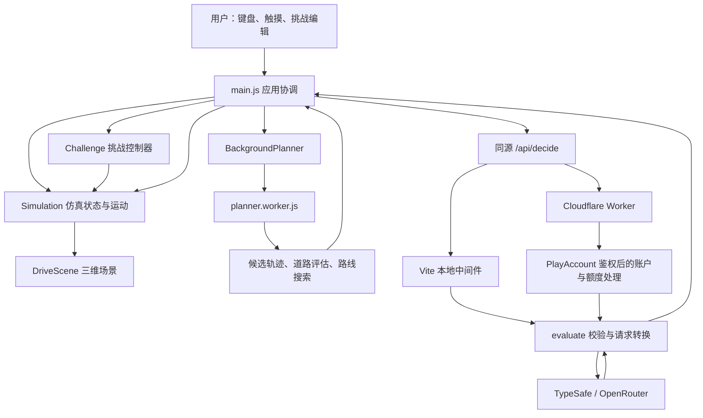
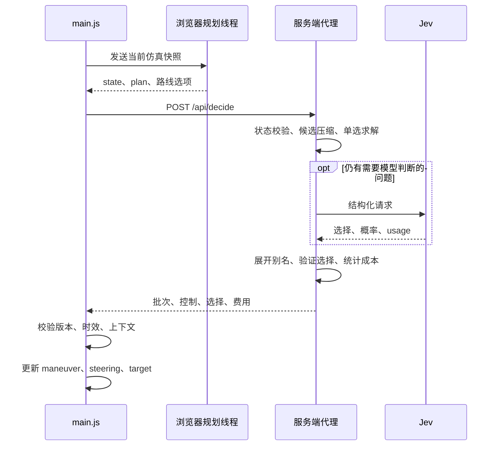
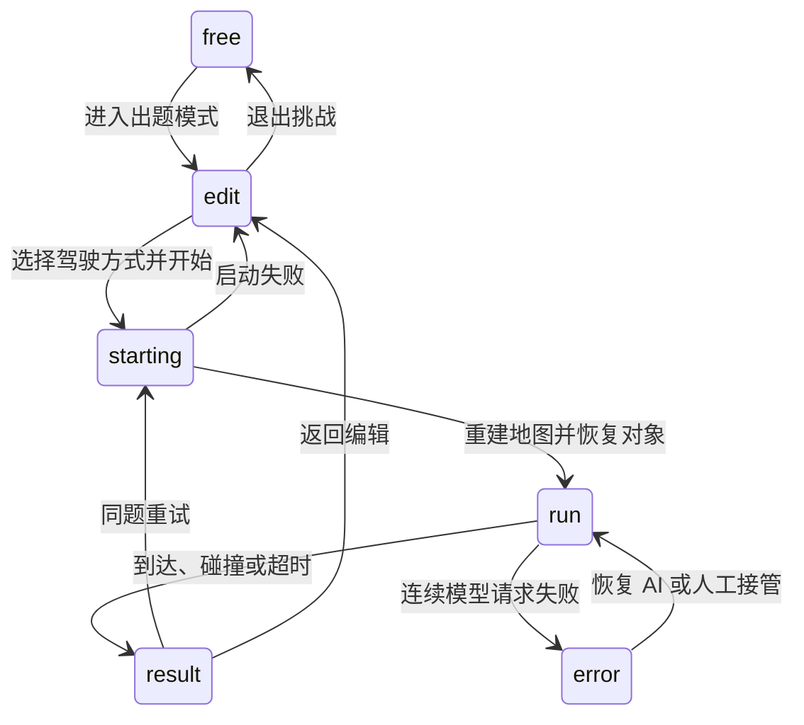

# JevPilot 项目架构与说明

> 本文基于 2026 年 9 月 28 日工作区中的源码编写，介绍当前实现、模块职责、数据流和开发方式。配置默认值以仓库代码为准；部署文档中的线上集成描述不代表本文已验证远端服务状态。

## 1. 项目定位

JevPilot 是一个运行在浏览器中的三维驾驶仿真项目，用于展示 Jev 模型在驾驶场景中的结构化决策能力。用户可以手动驾驶，也可以让 Jev 从本地生成的可行动作中进行选择，还可以在原有地图上布置车辆、摩托车和行人，创建限时驾驶挑战。

项目的关键设计是将驾驶任务拆成三部分：

1. **本地计算环境与动作**：浏览器维护地图、交通参与者、车辆运动、道路边界、导航和候选轨迹。
2. **模型选择驾驶方案**：服务端将紧凑的结构化观测和候选项发送给 Jev，获取选择结果与概率。
3. **本地执行与安全检查**：浏览器校验返回结果，在持续运行的仿真循环中执行控制，并根据实时风险限制速度或制动。

模型没有直接接管渲染循环，也不负责逐帧生成任意方向盘数值。它选择的动作来自本地规划器提供的候选集合。项目中的“感知”来源于仿真世界的数据与局部扫描，并非摄像头图像识别。

当前主要能力包括：

- 城市、小镇、高速公路三类程序化地图，以及基于种子的地图重建。
- 键盘和触摸驾驶、自动驾驶切换、导航、小地图和多种相机视角。
- 道路跟随、停车线接近、路口通行、障碍避让、受约束超车和驶离道路后的恢复。
- 原地图限时挑战编辑、人工或 Jev 驾驶、中途接管、结果统计和同题重试。
- 候选轨迹显示、模型请求与响应查看、交通等待原因诊断和现场导出。
- 本地个人密钥模式，以及 Cloudflare 托管登录和免费体验额度模式。

## 2. 技术栈与应用形态

| 层次 | 当前技术 | 作用 |
| --- | --- | --- |
| 前端语言 | JavaScript ES Modules | 模块化组织业务、仿真和界面代码 |
| 界面 | HTML、CSS、原生 DOM、Lucide | HUD、对话框、编辑面板、图标和交互 |
| 三维显示 | Three.js | 场景、模型、材质、光照、相机与轨迹显示 |
| 构建 | Vite 8 | 开发服务器、双 HTML 入口构建和模块打包 |
| 后台计算 | 浏览器 Web Worker | 候选动作采样与路线搜索 |
| 本地服务端 | Vite middleware、Node.js | 提供状态接口和模型代理 |
| 托管服务端 | Cloudflare Workers | 登录、接口鉴权、模型调用入口和页面保护 |
| 账户存储 | Cloudflare Durable Objects | 每用户余额、请求回执、扣费状态和可选候补名单同步 |
| 模型访问 | TypeSafe 或 OpenRouter 的 System One 接口 | 结构化选择问题与概率响应 |
| 测试 | Node.js 内置测试运行器、Playwright | 逻辑回归测试、浏览器检查和专项验证 |

仓库没有采用 React/Vue 等组件框架，也没有单独的 Express 服务。`main.js` 通过原生 DOM 构建和更新界面；本地 API 直接挂载到 Vite 服务。托管账户使用 Durable Object 存储，代码中没有独立的传统数据库服务。

## 3. 总体架构



这里有两个名称相近、职责完全不同的 Worker：

- **浏览器 Web Worker**：`src/planner.worker.js`，运行本地计算，不持有模型 API Key。
- **Cloudflare Worker**：`server/worker.js`，运行服务端路由、登录保护和模型访问入口。

`Simulation` 是浏览器中的运行状态主体。渲染层读取它，规划线程接收它的快照，挑战控制器对它进行重置和参与者注入。Cloudflare 服务端不持续推进整场驾驶，也没有接管客户端的全部物理状态。

## 4. 目录与模块职责

```text
jevpilot/
├── index.html                  驾驶页面入口
├── login.html                  登录页面入口
├── src/                        浏览器代码及可复用仿真逻辑
│   ├── bootstrap.js            先显示加载界面，再动态加载应用
│   ├── main.js                 初始化、输入、UI、决策调度与主循环
│   ├── simulation.js           仿真状态、交通规则、感知、导航与执行
│   ├── world.js / highway.js   程序化世界与路线基础
│   ├── planning.js             运动学、候选选择规则与控制结果校验
│   ├── driving-plan.js         候选轨迹生成、道路恢复与风险评估
│   ├── background-planner.js   主线程到规划线程的任务封装
│   ├── planner.worker.js       后台规划入口
│   ├── jev-request.js          紧凑模型请求与答案展开
│   ├── scene.js                Three.js 场景
│   ├── challenge*.js           原地图挑战编辑、运行和评分
│   ├── traffic-*.js            交通安全、诊断与查看器
│   └── arena*.js               保留的旧版独立竞技场及共享逻辑
├── server/
│   ├── jev-config.js           模型供应商与服务端配置
│   ├── jev.js                  输入校验、模型调用与本地中间件
│   ├── worker.js               Cloudflare 路由和鉴权入口
│   ├── auth.js                 签名会话、Cookie 与身份平台访问
│   └── account.js              PlayAccount Durable Object
├── public/                     模型、纹理、Draco 解码器与品牌素材
├── tests/                      Node.js 逻辑测试
├── scripts/                    浏览器与真实模型验证脚本
├── docs/                       部署说明、设计计划与本文
├── vite.config.js              开发代理、双入口与构建配置
├── wrangler.jsonc              Cloudflare 运行环境与绑定
└── .env.example                本地配置示例
```

### 4.1 应用与交互层

`main.js` 承担应用协调职责：创建仿真、渲染器、规划器和挑战控制器，维护键盘状态、登录与额度状态、请求状态、累计费用和调试面板。它也是理解系统实际调用顺序的主要入口。

相关交互模块分别承担较集中的职责：

| 模块 | 职责 |
| --- | --- |
| `camera-input.js` | 相机交互输入 |
| `minimap-controls.js` | 小地图拖动、缩放和跟随 |
| `touch-controls.js` | 触摸转向、油门和制动 |
| `tooltips.js` | 提示信息 |
| `challenge-hud-controls.js` | 挑战面板交互 |
| `loading-screen.js`、`asset-loading.js` | 加载界面、下一次绘制等待和资源加载协调 |

### 4.2 仿真与道路层

`simulation.js` 中的 `Simulation` 维护玩家车辆、环境车辆、行人、当前路线、感知结果、路口预约、停车记忆、碰撞与违规统计等状态。

主要方法包括：

- `reset()`：按地图类型和种子重建世界及运行状态。
- `step(dt)`：推进交通参与者和玩家运动，处理规则、安全限制、碰撞与到达状态。
- `rule()`、`speedEnvelope()`：计算交通规则与当前允许的速度范围。
- `scanScene()`：从仿真环境生成局部感知数据。
- `decisionState()`：组织规划与模型决策需要的完整观测。
- `chooseRoute()`、`installRoute()`：选择和安装新路线。
- `observation()`：提供调试与界面使用的观测信息。

道路与安全计算分散在专门模块中，避免所有算法都集中在 `Simulation` 内：

| 模块 | 职责 |
| --- | --- |
| `world.js` | 城市、小镇生成，主题参数，路网、路线和信号状态 |
| `highway.js` | 高速公路、匝道及相关路线生成 |
| `routing.js` | 从当前位置连接道路并搜索可用路线 |
| `road-geometry.js` | 路面几何、车辆轮廓、路面占用率和局部边界 |
| `traffic-safety.js` | 跟车间距、交通冲突预测和相对交通状态 |
| `collisions.js` | 运动过程中的碰撞检测 |
| `passing.js` | 高速超车与城市借道的空间、速度和冲突条件 |
| `courtesy.js` | 交通参与者之间的让行与缓慢挪动协调 |
| `math.js` | 随机数、角度、路径采样和位置计算 |

世界平面使用 `x/z` 坐标。模型请求说明中约定 `x` 向东、`z` 向南、航向角零表示朝北。代码内部速度主要使用米/秒，界面通常换算为千米/小时。

### 4.3 渲染与资源层

`scene.js` 中的 `DriveScene` 将仿真数据映射为 Three.js 对象，显示道路、建筑、车辆、行人、目的地和相机视图。相关模块包括：

- `vehicle-model.js`：车辆显示模型相关逻辑。
- `model-assets.js`：详细车辆模型加载、轮胎动画和模型处理。
- `scenery-assets.js`、`vegetation.js`：环境模型与植被。
- `materials.js`：材质、贴图和复用管理。
- `road-vectors.js`：候选轨迹与选中轨迹可视化。
- `crash-effects.js`：碰撞视觉效果。
- `render-profile.js`：像素比、抗锯齿、阴影和植被等质量参数。

当前渲染配置包含 `pixelRatio: 1.5`、`shadowSize: 2048` 和抗锯齿设置。它是统一质量配置，不能据此推断项目已实现按设备性能自动降级。

`public/models/` 和 `public/textures/` 内保留素材署名与许可文件；分发或替换资源时，应同时核对相应许可。`public/draco/` 为压缩模型提供解码资源。

## 5. 启动与运行时调度

### 5.1 页面启动

1. `index.html` 加载 `bootstrap.js`。
2. `bootstrap.js` 等待页面有机会绘制加载界面，再动态导入 `main.js`。
3. `main.js` 读取 URL 的 `world` 和 `seed`，创建 `Simulation`；页面默认地图为 `city`。
4. 应用构建 HUD，创建 `DriveScene`、`BackgroundPlanner` 和交互控制器。
5. 资源加载完成后开放驾驶操作。
6. 请求 `/api/status`，读取鉴权要求、模型配置和托管账户额度。
7. 启动动画循环与决策调度器。

例如 `/?world=town&seed=42` 可以固定地图类型与种子，便于排查和重复验证。相同种子可重建基础世界与初始交通；实际运行过程仍受用户输入和异步模型返回时机影响。

### 5.2 三种不同的更新节奏

| 更新类型 | 实现 | 说明 |
| --- | --- | --- |
| 显示与运动推进 | `requestAnimationFrame(animate)` | 每帧渲染，并按时间步推进仿真 |
| 规划与模型决策 | 定时检查后按条件启动异步任务 | 不阻塞渲染循环 |
| HUD 与小地图 | 主循环内节流 | HUD 约每 0.2 秒，小地图至多约每 0.1 秒更新 |

动画循环把单帧 `dt` 限制在 0.2 秒以内，再拆成不超过约 0.025 秒的物理子步。这能够减小低帧率时运动检测的跳跃，但不意味着浏览器长时间卡顿后会补算全部真实时间。

页面隐藏或资源仍在加载时，主循环不推进驾驶；暂停时停止仿真时间。普通模型网络等待期间仿真仍然运行，因此网络延迟会影响车辆实际表现和挑战计时。

## 6. Jev 决策链路

### 6.1 本地候选生成

`driving-plan.js` 的 `createDrivingPlan()` 结合车辆状态、道路边界、障碍物、导航和交通约束生成候选动作。`planning.js` 提供车辆运动学、轨迹投影、速度控制和候选选择规则。

当前规划常量包括：

| 常量 | 值 | 用途 |
| --- | --- | --- |
| `CANDIDATE_COUNT` | 12 | 候选批次上限 |
| `VECTOR_HORIZON` | 3 秒 | 候选轨迹预测时域 |
| `VECTOR_STEPS` | 60 | 轨迹投影步数参数 |
| `EVALUATION_STEPS` | 24 | 轨迹评估步数参数 |
| `WHEELBASE` | 2.7 米 | 车辆运动学参数 |
| `FULL_STOP_DISTANCE_M` | 2.5 米 | 完全停车选项相关距离阈值 |

候选项包含转向、目标速度、道路占用情况、路线偏离程度和碰撞预测等信息。一部分候选还包含停车线接近控制或超车机动参数。

道路恢复状态会允许更广泛的前进或倒车候选。正常道路驾驶则围绕道路与路线生成动作。服务端会再次检查候选的数值范围、批次 ID 和特殊机动参数。

### 6.2 后台规划线程

`BackgroundPlanner.run()` 将车辆、交通、行人、路口预约、路线版本、感知结果等信息整理成可传输快照，并发送到 Web Worker。

后台线程根据地图种子、地图类型和重置代次复用或重建自己的 `Simulation` 实例，再把最新快照覆盖进去。`locks`、`courtesy` 等 `Map` 在传输时转成数组，收到后恢复。

线程支持两类任务：

- 普通规划：调用 `decisionState()`，返回观测、候选计划和路线选项。
- 重规划路线：调用 `routeFromLocation()`，返回连接目的地的路线结果。

每个任务都有独立 ID 和 8 秒超时。主线程通过 Promise 接收结果；车辆运动与绘制不等待任务完成。应用层会检查会话代次和路线版本，避免把重置前的规划结果装回新世界。

### 6.3 模型输入压缩

`jev-request.js` 的 `prepareJevRequest()` 将完整本地观测转换为模型需要的紧凑请求：

- 为候选使用 `v0`、`v1` 等短别名，保留别名到原始候选 ID 的映射。
- 将数据组织为列名与行值构成的表格。
- 将多行相同的列提取为共享值，减少重复字段。
- 简化直线道路边界采样，同时保留转弯、宽度变化和未知边界信息。
- 按当前情境加入路口、跟车、障碍、恢复和路线选择说明。
- 只有需要路线选择时才加入相应路线问题和相关数据。
- 对只有一个合法答案的问题直接求解，减少外部模型调用。

每次请求都是独立的结构化输入，不能依赖模型记住上一轮驾驶状态。停车记忆、路口状态和恢复信息需要由本地逻辑明确维护并传入。

“单一合法答案本地求解”在这里指代理代码可以不请求外部模型。当前主页面仍会把完整状态发送给 `/api/decide`，由 `evaluate()` 返回结果；它不代表浏览器跳过了整个 HTTP 链路。

### 6.4 请求、返回与执行



`main.js` 每 25 毫秒检查是否可以启动决策，但不按 40 次/秒调用模型。`decisionInterval()` 在弯道、恢复、交通或路口等情况下返回 250 毫秒，在相对空旷时返回 650 毫秒。实际频率还受单请求进行中标志、网络延迟、暂停和错误退避影响。

服务端外部请求通常使用 10 秒超时，浏览器 `/api/decide` 请求使用 12 秒超时。即使网络尚未超时，超过 1.8 秒才到达的驾驶决策也会被视为过期；已应用动作超过 1.8 秒没有更新时，主循环把自动驾驶目标速度设为零。

执行前还会验证：

- 世界或驾驶会话是否已经切换。
- 当前路线版本是否仍与请求一致。
- 自动驾驶是否仍开启，是否暂停或发生碰撞。
- 返回的选择是否属于请求的候选批次。
- 信号灯、停车记忆等决策上下文是否已经变化。

因此，“模型返回成功”与“动作最终被执行”是两个不同事件。调试时应同时查看响应和执行记录。

## 7. 交通规则与安全控制

系统同时包含候选生成阶段的风险评估、服务端结果验证和运行时速度约束。

### 7.1 停车与路口

`Simulation.rule()` 处理信号灯、停车标志、行人和路口冲突等规则。停车记忆用于区分尚未履行停车要求与已经完成停车的情况。

`planning.js` 与 `driving-plan.js` 支持接近停车线时逐渐降速，相关候选携带停车线坐标、航向、目标余量和减速度。当前服务端对这种候选要求停车余量为 0.5 米，并校验减速度范围。

路口预约保存在 `locks` 中。`traffic-diagnostics.js` 的 `reservationConflicts()` 参与判断预约车辆是否实际与另一车辆的路径冲突，避免把无冲突的通行方向全部阻塞。

### 7.2 碰撞与跟车

`traffic-safety.js` 计算前车、相对运动和冲突风险；`road-geometry.js` 检查车辆轮廓与路面；`collisions.js` 检测运动区间中的碰撞。

模型选择不能替代这些检查。服务端会拒绝带有迫近碰撞风险的非零速度选择，浏览器执行时还会根据最新环境约束速度。挑战评分把连续制动的一次开始计为一次安全介入，而不是每一帧重复计数。

### 7.3 超车与借道

`passing.js` 包含高速同向超车和城市/小镇借道逻辑。城市借道会检查前车方向与速度差、直线长度、路面占用、路口范围、对向交通、行人和返回空间。

**当前源码比 README 的部分说明更进一步**：城市借道已考虑行驶中的慢车；静止前车等待不足 8 秒会通过 `recently_stopped` 暴露为风险信息，不再单独作为绝对禁止条件。行驶前车和静止前车使用不同的距离范围与速度上限。描述这一行为时，应以 `passing.js` 和 `urban-traffic.test.js` 为准。

这些条件只决定是否能提供特定机动，不能保证所有堵塞局面都会被解除。详细轨迹检查和运行时环境变化仍可能让车辆继续等待。

### 7.4 偏航恢复

`Simulation` 记录持续偏离路线的时间。当前相关常量包括偏离距离 30 米、持续时间 6 秒以及 30 秒的重规划冷却。

`routing.js` 负责查找重新连接路线的方案；`driving-plan.js` 提供局部道路恢复目标和候选动作。全局换路与局部恢复是不同层面的处理，修改其中一项时需要考虑两者的配合。

## 8. 原地图限时挑战系统

### 8.1 模块划分

| 文件 | 职责 |
| --- | --- |
| `challenge.js` | 编辑、开始、重试、接管、错误恢复和结果界面 |
| `challenge-model.js` | 草稿结构、对象创建、位置调整、校验、注入和评分 |
| `challenge-view.js` | 编辑视图、对象选择和场景交互 |
| `challenge-traffic.js` | 为可继续行驶的挑战车辆构造衔接交通的路线 |
| `challenge-hud-controls.js` | 挑战 HUD 操作 |
| `challenge.css` | 挑战界面样式 |

当前挑战直接复用主应用的原地图、渲染器和仿真，不需要切换到旧版低多边形场景。

### 8.2 草稿与参与者

草稿主要字段如下：

| 字段 | 含义 |
| --- | --- |
| `version` | 当前格式版本为 `2` |
| `name` | 挑战名称，最多 80 个字符 |
| `world.seed`、`world.type` | 地图种子与类型 |
| `limit` | 时间限制，允许 30～1800 秒 |
| `actors` | 用户布置的参与者，最多 24 个 |

参与者包含 `id`、`kind`、位置、`path`、`target`、`speed`、`trigger`、`distance` 和 `endBehavior` 等字段。支持慢车、停放车辆、摩托车和行人。

车辆放置会吸附到道路路径，路径按道路采样；行人使用线段路径。触发可以是立即触发或玩家靠近触发。移动汽车和摩托车默认采用 `continue`，衔接原生交通逻辑；选择 `stop` 时则在编排终点停车。

需要注意，脚本行人与到终点停车的编排动作不能等同于完整的自主避障驾驶。它们正是用户构造测试情境的一部分。

`validateChallenge()` 检查地图是否匹配、时间范围、对象数量、ID、坐标和路径等条件。导入 JSON 仍须经过校验，不能把任意 JSON 当作有效关卡。

### 8.3 生命周期



开始挑战会按草稿种子和类型重置世界，并恢复编排对象。人工驾驶无需模型 Key；Jev 驾驶需要服务端已配置且额度可用。

驾驶过程中可以切换人工和 Jev，计时与世界状态继续保留。最终结果通过驾驶者集合区分 `human`、`jev` 和 `mixed`。

`ChallengeScore` 的结束条件按碰撞、到达、超时依次判断。结果记录用时、时限、碰撞、违规、安全介入次数、行驶距离和本次挑战 API 成本。

连续三次决策错误会使挑战进入 `error` 并暂停计时，用户可以恢复 AI 或改为人工继续；连接中断不会直接伪装成一次碰撞或超时结果。

### 8.4 保存方式

草稿保存在浏览器 `localStorage` 的 `jevpilot-world-challenge-v2` 键中，同时支持 JSON 导入和导出。编辑支持撤销。

当前没有公共排行榜、服务端关卡库或跨设备草稿同步。挑战结果也不是由独立服务端仿真裁定的防作弊成绩。

### 8.5 旧版 Arena 的边界

`arena.js`、`arena-scene.js`、`arena-world.js` 和 `arena-model.js` 保留了较早的独立竞技场实现，但 `index.html → bootstrap.js → main.js` 才是当前入口。

旧文件仍有实际复用：`challenge-model.js` 从 `arena-model.js` 引入参与者类型，`simulation.js` 也使用其中的脚本参与者更新逻辑。因此，不能因为 Arena 不再是页面入口就直接删除整组文件。

## 9. 服务端接口与运行模式

### 9.1 本地与托管模式对比

| 项目 | 本地 Vite dev / preview | Cloudflare 托管 |
| --- | --- | --- |
| 服务入口 | `jevMiddleware()` | `worker.js` |
| 登录要求 | 不需要 | 驾驶页面与受保护 API 需要登录 |
| 模型凭据 | 本地环境变量 / `.env` | Worker 运行时 Secret |
| 免费体验账户 | 无 | 每用户一个 `PlayAccount` |
| 费用处理 | 返回调用成本，不维护演示余额 | 预留额度、结算、回执去重 |
| 并发限制 | 中间件实例最多 3 个活动请求 | 每账户单次进行中限制、至少 200 毫秒间隔 |
| 静态资源 | Vite 提供 | Workers Assets 提供 |

`npm run preview` 同样安装本地中间件，因此本地构建预览依然跳过托管登录和演示额度。`npm run dev:worker` 使用 Wrangler 路径，需要对应的 Worker 配置与绑定，不能视作相同的免登录开发模式。

### 9.2 接口列表

| 路径 | 方法 | 作用 |
| --- | --- | --- |
| `/api/status` | GET | 返回是否需要登录、是否已登录、模型配置、定价；托管模式还返回账户信息 |
| `/api/decide` | POST | 接收仿真状态并返回候选选择和控制信息 |
| `/api/auth/start` | POST | 托管模式发起身份平台登录 |
| `/api/auth/callback` | GET | 托管模式验证回调并建立会话 |
| `/api/auth/logout` | POST | 托管模式清除会话 Cookie |

决策请求外层结构为：

```json
{
  "state": "完整的结构化驾驶观测对象，此处仅示意",
  "request_id": "由浏览器生成的 UUID"
}
```

上例只展示字段关系，不是可直接提交的有效请求。实际 `state` 必须包括符合约束的速度、道路、恢复、转向上下文和候选批次等数据。

成功响应的主要字段包括 `selection`、`answers`、`controls`、`batch_id`、`decision_source`、`usage`、`latency_ms`、`cost_usd` 和 `pricing`；托管账户还附加 `credits`。

### 9.3 供应商选择

`jev-config.js` 优先使用 `OPENROUTER_API_KEY`，否则使用 `TYPESAFE_API_KEY`。默认模型为仓库配置中的 `jev-latest`，可通过 `JEV_MODEL` 覆盖。

配置的供应商入口分别为 OpenRouter 的 `/api/v1/systemone` 和 TypeSafe 的 `/v1/systemone`。两种路径都由服务端附加授权头，浏览器不接触密钥。

`evaluate()` 会优先使用响应中的有效 `usage.cost` 作为显示成本，否则根据 token 数与配置价格估算。**托管账户余额的结算目前按输入 token 与 `JEV_INPUT_PRICE` 计算**，与响应显示成本的取值规则不完全相同，接入供应商或修改价格时需要核对这两条路径。

## 10. 托管登录、额度与持久化

### 10.1 登录流程

1. 未登录用户访问受保护页面时重定向到 `/login`。
2. 登录页向 `/api/auth/start` 提交请求，服务端执行登录频率限制。
3. 服务端生成有效期为 10 分钟的签名 state，并同时写入浏览器 Cookie。
4. 身份平台完成登录后回调，服务端校验查询参数与 Cookie 中的 state 一致且签名有效。
5. 服务端交换一次性 code，校验用户身份并初始化对应账户。
6. 写入有效期 30 天的 `__Host-jevpilot` 会话 Cookie。

会话使用 HMAC-SHA256 签名，Cookie 带 `Secure`、`HttpOnly`、`SameSite=Lax` 和根路径。它是项目实现的签名令牌格式，不能直接当作标准 JWT 描述。

Worker 对经过其处理的 POST 请求校验 `Origin` 与 JSON 内容类型。受保护 API 未登录返回 401。静态资源不等同于受保护业务数据：`wrangler.jsonc` 只对指定页面和 `/api/*` 配置 Worker 优先执行，其他公开资源可由 Assets 提供。

### 10.2 PlayAccount 账户模型

每个身份平台用户 ID 对应一个 Durable Object。首次初始化授予代码中定义的 0.25 美元额度；重新登录或重建地图不会重新赠送。

账户数据包括用户资料、余额、累计消费、创建时间、最近请求回执、进行中的扣费预留，以及可选的 early-access 同步状态。金额使用整数纳美元保存，1 美元等于 10 亿纳美元。

付费决策流程为：

1. 校验 `request_id`，命中最近回执时直接返回，避免重复执行。
2. 拒绝同账户并发请求或过密请求。
3. 校验观测，限制紧凑请求不超过 24,000 字节。
4. 根据请求字节数、4,096 的额外余量和输入价格计算预留金额。
5. 先持久化扣除预留金额及 pending 状态，再访问上游模型。
6. 收到合法 usage 后按实际输入 token 结算，退回差额。
7. 保存响应回执，目前只保留最近 8 条。

对无法确认是否已经计费的超时或中断调用，代码保留预留扣款；明确不可计费的上游失败按代码标记退款。对象重新启动时也会处理遗留 pending，防止通过中断调用重复拿回可能已经消耗的额度。

当前托管账户要求输出价格为零，因为尚未实现输出 token 的有界预留。余额不足以预留下次费用时返回 402，可能仍保留少量剩余余额。

### 10.3 可选候补名单同步

用户勾选 early-access 才会记录选择并安排同步。Durable Object alarm 通过 `WAITLIST` 跨 Worker 绑定调用现有服务，失败后退避重试，不阻塞驾驶。

这是一项外部部署依赖；复制仓库或更换 Cloudflare 账户时，需要重新配置相应绑定，不能假定原绑定在新环境可用。

### 10.4 数据存放位置

| 数据 | 存放位置 | 生命周期 |
| --- | --- | --- |
| 世界、车辆和交通状态 | 浏览器 `Simulation` 内存 | 刷新或重置后重建 |
| 后台规划副本 | 浏览器 Web Worker 内存 | 线程与世界代次相关 |
| 挑战草稿 | `localStorage` / 导出 JSON | 当前浏览器持久化或用户自行保存 |
| 驾驶诊断与决策记录 | 浏览器内存 / 下载 JSON | 调试使用 |
| 登录会话 | 签名 HttpOnly Cookie | 默认 30 天 |
| 托管额度与回执 | Durable Object storage | 跨请求、跨会话持久化 |
| 模型密钥 | 本地环境变量或 Worker Secret | 由运行环境管理 |

## 11. 可观测性与排错

项目提供了三类互补的调试入口：

1. **候选轨迹显示**：观察规划器给出的动作、预测风险和最终选中轨迹。
2. **JSON 面板**：查看 Jev input、局部感知、完整世界和响应概率等信息。
3. **路况诊断**：通过 `traffic-inspector.js` 与 `traffic-diagnostics.js` 查看车辆等待原因、阻挡对象和借道条件，并导出现场。

`decision-trace.js` 记录决策和执行信息。`main.js` 对响应标记已应用、上下文变化丢弃、会话变化丢弃或错误等状态，这有助于区分“模型选错”“候选不足”和“响应过期”。

诊断 JSON 包含地图信息、运行时间、挑战时钟、车辆、行人、路口预约和决策记录，不包含 API 凭据。它与挑战草稿是不同格式，不能直接作为关卡导入，也不是完整可复现的通用回放文件。

常见排查路径如下：

| 现象 | 优先检查 |
| --- | --- |
| 自动驾驶无法开启 | `/api/status`、密钥配置、托管剩余额度 |
| 车辆等待但没有碰撞 | 路况诊断中的红灯、前车、预约冲突、触发条件和返回空间 |
| 模型已返回但车辆未执行 | 决策批次、路线版本、1.8 秒时效和上下文变化 |
| 挑战对象位置不正确 | 草稿地图种子、道路吸附、路径与导入校验 |
| 三维界面卡顿 | 资源加载、渲染质量、候选显示和主线程负载 |
| 费用与额度扣减不一致 | `usage.cost` 显示规则与账户 token 结算规则 |

## 12. 本地运行与配置

在仓库根目录执行以下 PowerShell 命令：

```powershell
npm ci
Copy-Item .env.example .env
# 编辑 .env，填写一个模型供应商的 Key；已有 .env 时无需再次复制。
npm run dev
```

开发地址默认为 `http://localhost:5173`，端口被占用时会失败而不是自动换端口。人工驾驶和人工挑战不需要模型 Key。

本地配置项：

| 变量 | 用途 |
| --- | --- |
| `OPENROUTER_API_KEY` | OpenRouter 密钥，优先于 TypeSafe |
| `TYPESAFE_API_KEY` | TypeSafe 密钥 |
| `JEV_MODEL` | 模型名称，默认 `jev-latest` |
| `JEV_INPUT_PRICE` | 每百万输入 token 的配置价格 |
| `JEV_OUTPUT_PRICE` | 每百万输出 token 的配置价格 |
| `JEV_HOST` | Vite 监听地址，默认 `localhost` |
| `JEV_ALLOWED_HOSTS` | 逗号分隔的允许主机名 |

仓库示例价格为输入 0.042 美元/百万 token、输出 0；这些是代码默认配置，不能作为供应商实时价格承诺。修改 `.env` 后需要重启本地服务器。密钥不能使用 `VITE_` 前缀变量，以免被打入浏览器产物。

## 13. 构建与部署

```powershell
npm run build
npm run preview
```

Vite 构建 `index.html` 与 `login.html` 两个入口，产物输出到 `dist/`，并对 Three.js 设置独立代码分组。

Cloudflare 配置由 `wrangler.jsonc` 描述：

- 服务入口是 `server/worker.js`。
- 开启 `nodejs_compat`，供共享服务端代码使用相关 Node.js 能力。
- `ASSETS` 指向 `dist/`。
- `PLAY_ACCOUNTS` 绑定 `PlayAccount`，通过迁移声明创建 SQLite 类型 Durable Object。
- `WAITLIST` 指向外部 Worker 的对象类。
- `AUTH_LIMITER` 为登录入口提供限流。
- `APP_ORIGIN`、身份平台地址、项目 ID 和定价作为非秘密变量配置。

托管环境还需要供应商密钥、`PLATFORM_PARTNER_SECRET` 和 `SESSION_SECRET` 等运行时秘密。原仓库的域名、账户和跨 Worker 绑定具有部署环境特异性，迁移时需要逐项替换。

`npm run deploy` 会构建后执行实际部署；`npm run dev:worker` 会构建后启动 Wrangler。具体发布集成方式参考 [Cloudflare 托管说明](hosting.md)。该文档描述原仓库通过 Cloudflare Workers Builds 监听 `main` 分支发布，但这一远端设置不由本地源码单独保证。

保留账户 Durable Object 的命名空间和迁移历史很重要，否则可能失去既有余额数据。轮换会话签名秘密会使现有会话失效，但不会自动清空账户存储。

## 14. 测试与验证体系

### 14.1 逻辑测试

`npm test` 使用 Node.js 自带的测试运行器执行 `tests/*.test.js`。测试按能力分组：

| 文件 | 主要覆盖方向 |
| --- | --- |
| `simulation.test.js` | 仿真与运动行为 |
| `freeplay.test.js` | 手动驾驶与自由探索 |
| `jev.test.js` | 结构化选择、输入与模型交互相关逻辑 |
| `decision-pipeline.test.js` | 决策链路与执行条件 |
| `road-recovery.test.js` | 道路占用与恢复 |
| `traffic-safety.test.js` | 跟车与交通风险 |
| `collisions.test.js` | 碰撞检测 |
| `urban-traffic.test.js` | 城市交通、借道与诊断 |
| `challenge.test.js` | 挑战草稿与评分等逻辑 |
| `challenge-traffic.test.js` | 挑战参与者与原生交通衔接 |
| `auth.test.js` | 会话校验与本地免登录行为 |
| `arena.test.js` | 保留的旧竞技场逻辑 |

### 14.2 浏览器和真实模型验证

| 命令 / 脚本 | 用途 |
| --- | --- |
| `npm run test:browser` | 浏览器基本功能及驾驶流程检查 |
| `npm run test:browser:failures` | 浏览器故障场景检查 |
| `npm run test:experience` | 浏览器体验相关检查 |
| `npm run test:jev` | 使用 `.env` 对真实 Jev 驾驶进行验证 |
| `npm run test:stop-line` | 使用真实模型验证停车线行为 |
| `scripts/browser-challenge-drivers.mjs` | 挑战驾驶方式相关浏览器验证 |
| `scripts/replay-challenge.mjs` | 挑战专项重运行与指标输出 |

浏览器脚本通常要求本地服务先启动；部分脚本的默认 Chromium 路径写成了 macOS 缓存路径。在 Windows 上，`browser-check.mjs` 和 `browser-failures.mjs` 可使用 `PLAYWRIGHT_CHROMIUM_EXECUTABLE_PATH` 覆盖；`browser-experience.mjs` 当前直接指定路径，需要另行调整。不能假定所有浏览器脚本开箱即用。

真实 Jev 验证需要可用密钥并可能产生供应商费用。逻辑测试、浏览器交互测试和真实模型测试验证的是不同层次，不能互相替代。本文是基于源码的架构说明，不表示已执行上述测试或验证线上部署。

## 15. 扩展与维护建议

### 15.1 修改功能时的主要落点

| 目标 | 优先查看的文件 | 需要同步考虑 |
| --- | --- | --- |
| 新增地图 | `world.js`、`highway.js`、`scene.js` | 导航、道路几何、挑战地图匹配 |
| 新增候选动作 | `driving-plan.js`、`planning.js` | 服务端 `validState()`、请求压缩、执行安全 |
| 调整模型说明 | `jev-request.js` | 候选语义、无模型记忆、请求大小 |
| 新增交通参与者 | `arena-model.js`、`challenge-model.js`、`simulation.js` | 渲染、碰撞轮廓、触发与路径校验 |
| 调整挑战评分 | `challenge-model.js`、`challenge.js` | 暂停、接管、重试与计时语义 |
| 新增供应商 | `server/jev-config.js`、`server/jev.js` | 协议兼容、错误处理、usage 与成本 |
| 修改额度规则 | `server/account.js` | 并发、重复请求、中断和预留结算 |
| 优化显示性能 | `scene.js`、资源与渲染配置模块 | 主线程负载、模型体积与视觉质量 |

### 15.2 需要保持的架构约束

1. **仿真与显示保持分工**：物理和规则应能脱离 Three.js 执行，便于测试和后台规划。
2. **候选生成、模型请求和执行共同维护**：添加字段或机动时，要同时检查序列化、服务端校验与执行语义。
3. **保留异步结果失效机制**：世界重置、路线变化和人工接管不能让旧响应重新控制车辆。
4. **区分三类时间**：仿真时间、浏览器真实经过时间和模型请求延迟各有用途。
5. **密钥始终留在服务端**：前端只访问同源业务接口。
6. **计费在服务端处理**：界面成本展示不能取代账户预留、结算和回执。
7. **区分草稿、现场与成绩**：它们分别是编排输入、诊断状态和运行结果，不应混用格式。

当前 `main.js` 和 `simulation.js` 承担较多职责。后续若继续扩展，可以分别抽出决策调度器、统计状态、交通规则和生命周期协调模块；这是维护建议，并非当前已经完成的重构。

## 16. 推荐源码阅读顺序

1. `index.html → bootstrap.js → main.js`：先理解应用如何启动、输入如何进入系统。
2. `simulation.js → world.js → planning.js`：理解世界状态、运动和控制。
3. `background-planner.js → planner.worker.js → driving-plan.js`：理解候选如何计算。
4. `jev-request.js → server/jev.js`：理解模型实际收到什么，以及结果如何校验。
5. `challenge.js → challenge-model.js → challenge-traffic.js`：理解当前限时挑战。
6. `scene.js` 与资源模块：理解仿真如何可视化。
7. `server/worker.js → auth.js → account.js`：理解托管模式的身份、额度与持久化。
8. 对照相关 `tests/` 和 `scripts/`：确认具体行为、边界条件和验证方式。

相关资料：[项目 README](../README.md)、[托管部署说明](hosting.md)、[设计计划目录](plans/)。设计计划用于了解演进背景，当前行为仍应以实现与测试为准。
